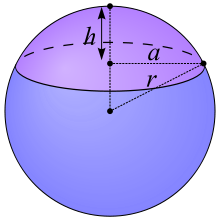
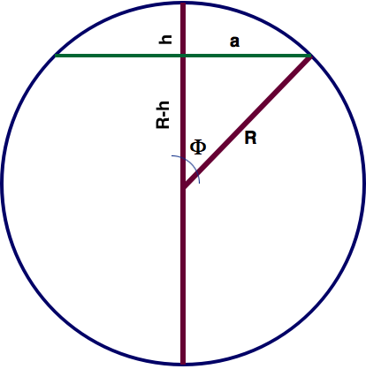

```{r setup, include=FALSE}
knitr::opts_chunk$set(echo = FALSE)
```

## Enunciado Ejercicio 1
<p style="text-align: justify;">
Demuestra la fórmula de la dureza Brinell
</p>

## Área del casquete esférico
<p style="text-align: justify;">
El área de una esfera se demuestra que es $A_{esfera}=4 \cdot \Pi \cdot R^2$ 

Simplemente por proporcionalidad, se puede razonar que una esfera es un "casquete esférico" donde $h=2R$. Mediante una sencilla regla de 3...

<center>

</center>

$$\frac{A_{esf}}{2R}=\frac{A_{cas}}{h}$$
$$\frac{4\cdot\pi\cdot R^2}{2R}=\frac{A_{cas}}{h}$$

<center>Luego $A_{cas}=2 \pi R h$</center>
</p>

## Área del casquete esférico (2)
<p style="text-align: justify;">
<center>

</center>

Tenemos que, por Pitágoras:
$$ R^2 = {(R-h)}^2+a^2 $$
Luego, 
$$ h=\frac{2R-\sqrt{4R^2-4a^2}}{2}=R-\sqrt{R^2-a²}$$
Y sustituyendo $R=D/2$ y $a=d/2$
$$ h=\frac{D}{2}-\frac{1}{2} \cdot \sqrt{D^2-d^2}$$
Y el área queda como...
$$ A_{cas}=2 \pi Rh = 2 \pi \frac{D}{2} \left [\frac{D}{2}-\frac{1}{2} \cdot \sqrt{D^2-d^2}  \right ] =  \frac{\pi D}{2} \left ( D- \sqrt{D^2-d^2}  \right )$$

</p>

## Y la dureza Brinell
<p style="text-align: justify;">
Si en el ensayo se ha ejercido una fuerza F
$$ HB = \frac{F}{S} $$
Siendo S la superficie de la huella (casquete esférico), cuyo diámetro o marca es d. La bola tiene un diámetro D.
$$ HB = \frac{F}{\frac{\pi D}{2} \left ( D- \sqrt{D^2-d^2}  \right )} = \frac{2 \cdot F}{{\pi D} \left ( D- \sqrt{D^2-d^2}  \right )}$$

</p>

## Otra fórmula del área del casquete esférico es
$$A_{cas}=2 \pi R h$$
Y se puede ver fácilmente que $R-h=R \cdot cos(\Phi)$

De aquí: $h=R \cdot (1-cos(\Phi))$

O: $h=\frac{D}{2} \cdot (1-cos(\Phi))$

Con lo que 
$$A_{cas}=\frac{\pi \cdot D^2}{2} \cdot (1-cos(\Phi))$$

