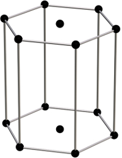
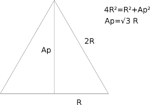
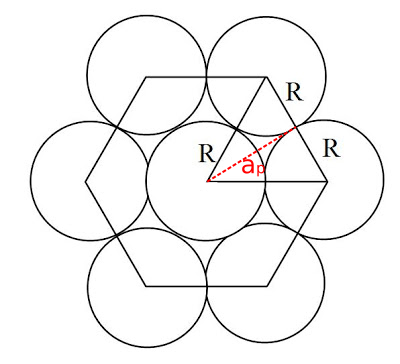

```{r setup, include=FALSE}
knitr::opts_chunk$set(echo = FALSE)
```

## Ejercicio 4. Factor de empaquetamiento red hexagonal simple

<p style="text-align:justify;">
Calcular el factor de empaquetamiento red hexagonal simple
</p>
<hr>
<p style="text-align:center;">

</p>
<p style="text-align:center;">
__Nº de átomos:__ $N_{vert}/(6\,celdas)+N_{base}/(2\,celdas)=12/6+2/2=3$
</p>
<p style="text-align:center;">
__Volumen de los átomos:__ $V_{atomos}= 3 \cdot \frac{4}{3} \pi R^3 = 4 \pi R^3$
</p>

## Volumen de la celda. Apotema
<p style="text-align:center;">

</p>
<p style="text-align:justify;">
La apotema es $A_{p}=\sqrt{3} R$
</p>
## Volumen de la celda. Área de la base y altura.
<p style="text-align:center;">

</p>
<p style="text-align:justify;">
El área de la base es $A=6\cdot2\cdot \frac{b\cdot h}{2} = 12 \cdot \frac{1}{2} \cdot R \cdot \sqrt{3}R =6\sqrt{3}R^2$ 
La altura de la celda sería la de dos átomos, luego $H=2R$
</p>

<p style="text-align:justify;">
Por fin, el volumen de la celda es $$\mathbf{V_{celda}=} A\cdot H = 6\sqrt{3}R^2 \cdot 2R =\mathbf{12\sqrt{3}R^3}$$
</p>

## Solución. Factor de empaquetamiento.
<p style="text-align:justify;">
$$FEA_{hex}=\frac{V_{atomos}}{V_{celda}}= \frac{4 \pi R^3}{12\sqrt{3}R^3}=\frac{\pi}{3\sqrt{3}}=\mathbf{0.605} $$
</p>

```{r datos0, echo=FALSE, warning=FALSE}
library("units")

```
