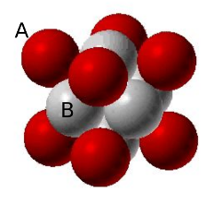

```{r setup, include=FALSE}
knitr::opts_chunk$set(echo = FALSE)
```

## Ejercicio 7
<p style="text-align:justify;">
Átomos de elementos diferentes, A y B, se empaquetan en una red FCC, en la que los átomos de A ocupan los vértices y los de B el centro de las caras. ¿Qué fórmula química más sencilla tiene el compuesto A-B?
</p>
<hr>
<p style="text-align:center;">

</p>

```{r datos0, echo=FALSE, warning=FALSE}
library("units")

```
<p style="text-align:justify;">
1. Hay 8 átomos de A, cada uno en un vértice, compartido por 8 celdas. Luego __hay un átomo de A por celda__.
2. Tenemos 6 átomos de B en una celda, cada uno en una cara, compartido con 2 celdas. Por lo tanto __tenemos 3 átomos de B por celda__.
3. Podemos concluir entonces que por celda tenemos 3 átomos de B y uno de A, luego la fórmula sería $\mathbf{AB_{3}}$
</p>
