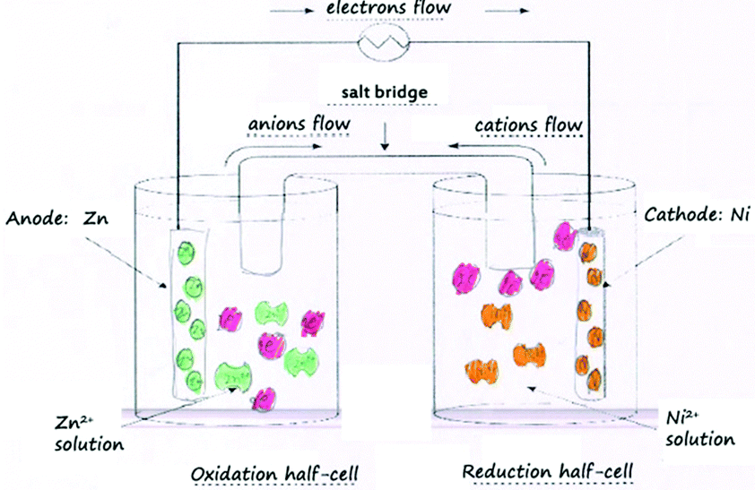

```{r setup, include=FALSE}
knitr::opts_chunk$set(echo = FALSE)
```

## Ejercicio 7. Pila Galvánica de Zn y Ni.
<p style="text-align:justify;">
Una pila galvánica está compuesta por un electrodo de cinc sumergido en una disolución 1M de $ZnSO_{4}$ y el otro electrodo de Níquel está sumergido en 1M de $NiSO_{4}$ , separadas por un tabique poroso. $R=8.31\cdot J\cdot mol^{-1}\cdot K^{-1}$ y $F=96500\cdot C/mol$ .

(a) ¿Qué electrodo es el ánodo y cuál el cátodo?

(b) Fuerza electromotriz de la pila a 25ºC

(c) Fuerza electromotriz de la pila a 40ºC

(d) Fuerza electromotriz de la pila a 25ºC con ambas concentraciones a 2M

(e) Fuerza electromotriz de la pila a 40ºC con concentraciones $[Zn^{2+}]=2\cdot[Ni^{2+}]$
</p>

```{r datos0, echo=FALSE, warning=FALSE}
library("units")
EoZn=set_units(-0.763,V)
EoNi=set_units(-0.25,V)
Eo=EoNi-EoZn
F=set_units(96500,C/mol)
R=set_units(8.31,J/(mol*K))
T=set_units(40+273,K)
n=2
E=Eo-2.303*(R*T/(n*F))*log10(2)
```

## Apartado a
<p style="text-align:justify;">
Los potenciales estándar son: $E_{Zn}^0 = `r EoZn` \cdot V$ y del Níquel, $E_{Ni}^0 = `r EoNi` \cdot V$
</p>
<p style="text-align:justify;">
El potencial de reducción del Níquel es mayor, luego es el que se reduce, siendo entonces Ni el cátodo y Zn el ánodo (el que se oxida).
$$ \left.\begin{matrix}
Zn \longrightarrow Zn^{+2} + 2e^-\\ 
Ni^{2+} + 2e^- \longrightarrow Ni
\end{matrix}\right\} Zn + NiSO_4 \overset{2e^{-}}{\longrightarrow} ZnSO_4 + Ni$$
<hr>
<p style="text-align:center;">

</p>

## Apartado b
<p style="text-align:justify;">
A 25ºC
$$E^0=E_{cat}-E_{ani}=E_{Ni}^0-E_{Zn}^0=\\= `r EoZn`\,V-(`r EoNi`\,V)=`r Eo`\,V $$
</p>

## Apartado c
<p style="text-align:justify;">
Según la ecuación de Nernst, y sabiendo que las concentraciones son $[Zn^{2+}]=[Ni^{2+}]=1\,M$
</p>
<p style="text-align:justify;">
$$ E=E^{0}-2.303\cdot\frac{RT}{nF}\cdot log\left(\frac{[Zn^{2+}]}{[Ni^{2+}]}\right)\\=E^{0}-2.303\cdot\frac{RT}{nF}\cdot log\left(1\right)=E^{0}=`r Eo` \cdot V$$
</p>
<p style="text-align:justify;">
En este caso, la temperatura no tiene influencia ninguna. $E_{40ºC}^0 = E^0=`r Eo` \cdot V$ , ya que el logaritmo de la unidad es cero.
</p>

## Apartado d
<p style="text-align:justify;">
Por la misma razón que antes, aunque cambien las concentraciones, si son iguales, no cambia el potencial: $E^0=`r Eo` \cdot V$
</p>

## Apartado e: aplicando la ec. de Nernst
<p style="text-align:justify;">
En este caso sí que justificamos el uso de la ecuación de Nernst.
$$ E=E^{0}-2.303\cdot\frac{RT}{nF}\cdot log\left(\frac{[Zn^{2+}]}{[Cu^{2+}]}\right)=\\=E^{0}-2.303\cdot\frac{`r R`\, J\cdot mol^{-1}\cdot K^{-1} \cdot `r T`\,K}{`r n` \cdot `r F`\,C/mol}\cdot log\left(2\right)=\\=0.513 \cdot V - 0.031 \cdot log(2) \cdot V = \boldsymbol{`r round(E,3)`\,V}$$
</p>